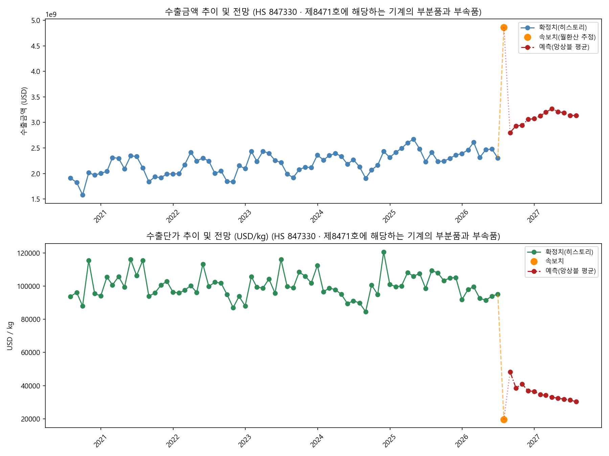

# 수출 속보치 결합 분석 리포트 — HS 847330 (제8471호에 해당하는 기계의 부분품과 부속품)

- 생성 시각: 2026-07-22 16:21
- 속보치 기준일: 2026-07-20

## 1. 현재 추세 요약

- 당월(속보치 월환산) 수출금액: **4,862,491,056 USD** (전월비 +111.02%)
- 당월(속보치) 수출단가: **19,625.20 USD/kg** (전월비 -79.39%)
- 전년동월비 수출금액: **+101.41%**, 수출단가: **-82.07%**

## 2. 추이 및 전망 그래프

## 3. 향후 12개월 예측 (SARIMA / Theta / ExponentialSmoothing 앙상블 평균)

- 사용된 모델(수출금액): SARIMA, Theta, ETS
- 사용된 모델(수출단가): SARIMA, Theta, ETS

| 예측월 | 수출금액(USD) | 수출단가(USD/kg) |
|---|---:|---:|
| 2026-08 | 2,800,522,349 | 48,307.38 |
| 2026-09 | 2,933,276,855 | 38,587.29 |
| 2026-10 | 2,944,672,335 | 40,994.06 |
| 2026-11 | 3,060,589,027 | 36,832.31 |
| 2026-12 | 3,073,009,274 | 36,476.09 |
| 2027-01 | 3,127,389,985 | 34,580.06 |
| 2027-02 | 3,202,226,692 | 34,120.98 |
| 2027-03 | 3,267,215,541 | 32,993.09 |
| 2027-04 | 3,211,297,697 | 32,421.60 |
| 2027-05 | 3,189,643,847 | 31,826.68 |
| 2027-06 | 3,138,479,122 | 31,346.37 |
| 2027-07 | 3,133,881,698 | 30,282.93 |
