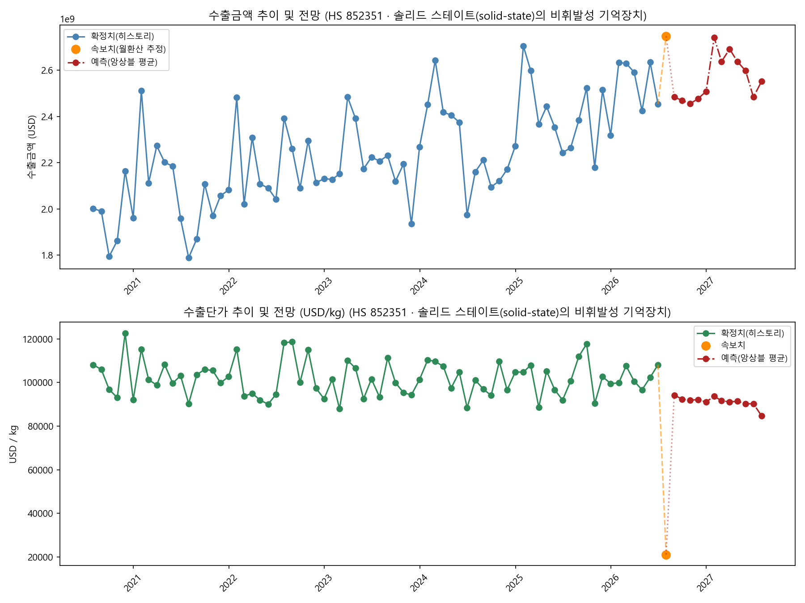

# 수출 속보치 결합 분석 리포트 — HS 852351 (솔리드 스테이트(solid-state)의 비휘발성 기억장치)

- 생성 시각: 2026-07-22 16:21
- 속보치 기준일: 2026-07-20

## 1. 현재 추세 요약

- 당월(속보치 월환산) 수출금액: **2,747,671,854 USD** (전월비 +11.97%)
- 당월(속보치) 수출단가: **21,069.49 USD/kg** (전월비 -80.52%)
- 전년동월비 수출금액: **+21.35%**, 수출단가: **-79.07%**

## 2. 추이 및 전망 그래프

## 3. 향후 12개월 예측 (SARIMA / Theta / ExponentialSmoothing 앙상블 평균)

- 사용된 모델(수출금액): SARIMA, Theta, ETS
- 사용된 모델(수출단가): SARIMA, Theta, ETS

| 예측월 | 수출금액(USD) | 수출단가(USD/kg) |
|---|---:|---:|
| 2026-08 | 2,484,284,538 | 94,250.11 |
| 2026-09 | 2,469,682,674 | 92,406.44 |
| 2026-10 | 2,455,047,039 | 91,984.01 |
| 2026-11 | 2,477,135,079 | 92,135.95 |
| 2026-12 | 2,508,325,150 | 91,082.44 |
| 2027-01 | 2,741,752,981 | 93,745.39 |
| 2027-02 | 2,637,896,383 | 91,624.33 |
| 2027-03 | 2,692,073,763 | 91,165.77 |
| 2027-04 | 2,637,454,776 | 91,387.57 |
| 2027-05 | 2,598,229,130 | 90,277.22 |
| 2027-06 | 2,483,995,871 | 90,255.43 |
| 2027-07 | 2,551,862,551 | 84,765.18 |
