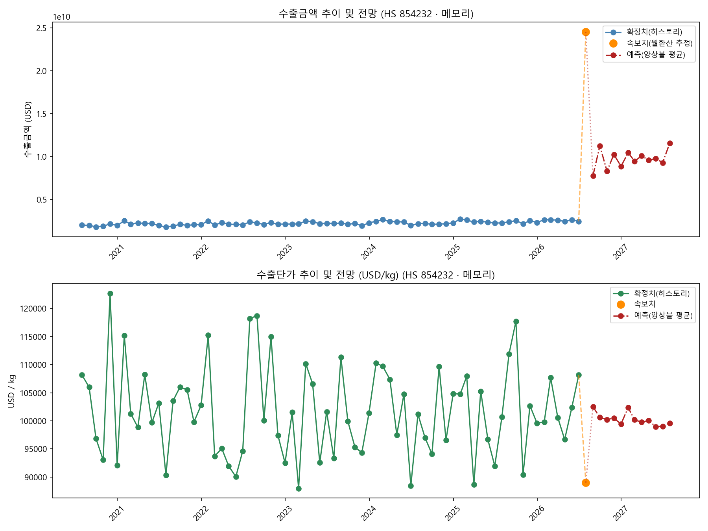

# 수출 속보치 결합 분석 리포트 — HS 854232 (메모리)

- 생성 시각: 2026-07-22 16:20
- 속보치 기준일: 2026-07-20

## 1. 현재 추세 요약

- 당월(속보치 월환산) 수출금액: **24,541,220,145 USD** (전월비 +900.09%)
- 당월(속보치) 수출단가: **89,003.97 USD/kg** (전월비 -17.71%)
- 전년동월비 수출금액: **+983.89%**, 수출단가: **-11.59%**

## 2. 추이 및 전망 그래프

## 3. 향후 12개월 예측 (SARIMA / Theta / ExponentialSmoothing 앙상블 평균)

- 사용된 모델(수출금액): SARIMA, Theta, ETS
- 사용된 모델(수출단가): SARIMA, Theta, ETS

| 예측월 | 수출금액(USD) | 수출단가(USD/kg) |
|---|---:|---:|
| 2026-08 | 7,770,121,298 | 102,518.10 |
| 2026-09 | 11,257,712,446 | 100,621.09 |
| 2026-10 | 8,301,832,836 | 100,243.91 |
| 2026-11 | 10,254,346,557 | 100,487.89 |
| 2026-12 | 8,863,286,976 | 99,436.15 |
| 2027-01 | 10,444,850,734 | 102,366.21 |
| 2027-02 | 9,464,688,621 | 100,175.85 |
| 2027-03 | 10,089,407,873 | 99,761.99 |
| 2027-04 | 9,571,753,864 | 100,079.97 |
| 2027-05 | 9,774,007,274 | 98,970.77 |
| 2027-06 | 9,288,669,167 | 99,026.42 |
| 2027-07 | 11,568,299,625 | 99,605.47 |
